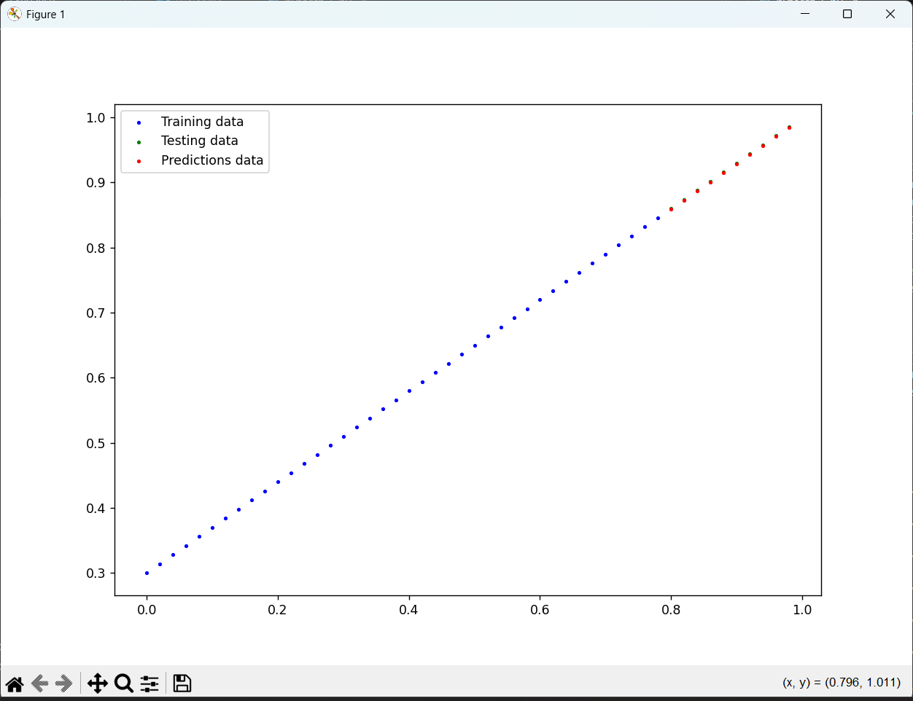
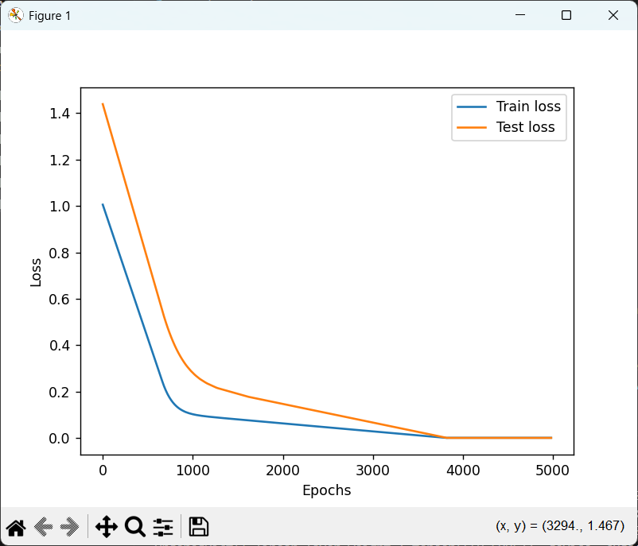

# Linear Regression with PyTorch

This is a simple project implementing **Linear Regression** using **PyTorch**, created as a first step into machine learning and deep learning.

## 🔍 Overview

We create and train a linear regression model from scratch using PyTorch. The model learns to approximate a linear relationship:

y = 0.7 * x + 0.3

The model is trained and tested on synthetically generated data using L1 Loss and optimized using SGD.

---

## 🛠️ Features

- Custom linear regression model using `nn.Module`
- Loss function: `nn.L1Loss()`
- Optimizer: `torch.optim.SGD`
- Device-agnostic training (CPU/GPU)
- Matplotlib visualizations for:
  - Model predictions
  - Training and test loss over epochs

---

## 📈 Results

The model learns the linear relationship successfully. Here's a sample prediction plot:

And training/test loss over epochs:

---

## 📁 Project Structure

linear-regression-pytorch/
    ├── First_ML_LR_model.py # Main PyTorch code
    ├── README.md # Project overview
    └── assets/
        ├── prediction_plot.png # Model predictions
        └── loss_curve.png # Loss graph

---

## 🚀 How to Run

1. Clone the repository:
    bash
    git clone https://github.com/your-username/linear-regression-pytorch.git
    cd linear-regression-pytorch

2. Install required libraries:
    pip install torch matplotlib numpy

3. Run the script:
    python linear_regression.py

---

## 🧠 What I Learned
1. Basics of PyTorch tensors, models, loss functions, and optimizers
2. Splitting data into train/test sets
3. Device-aware code for GPU training
4. How to track and plot model performance

---

## 🧑‍💻 Author
Prathamesh Vijay Deshpande
Student, IITT (B.Tech CSE)
This is my first machine learning model built and trained using PyTorch.

---

## 📌 Future Plans
1. Convert this into a Jupyter Notebook for better interactivity
2. Try using MSELoss and compare with L1Loss
3. Use real-world data instead of synthetic data

---

## ⭐️ Acknowledgements
Inspired by official PyTorch tutorials and beginner deep learning resources and YouTube videos.